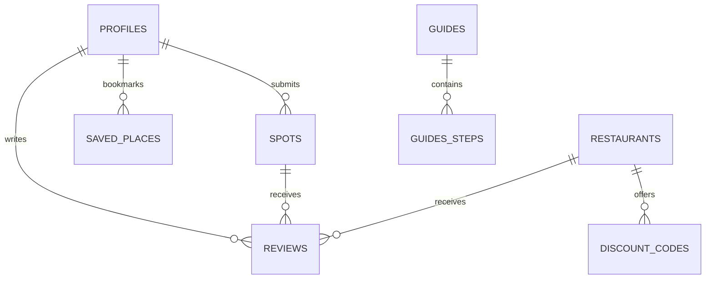

# 🌿 LiveLocal — Local Tourism & Influencer Eatery Discovery App

> [!IMPORTANT]
> **Current status: prototype baseline.** The feature descriptions below are
> historical prototype/coursework descriptions and must not be read as claims
> of production completion, backend authorization, offline persistence, or
> store readiness. The approved target behaviour and current implementation
> gaps are documented in
> [`docs/product/product-behaviour-spec.md`](docs/product/product-behaviour-spec.md)
> and [`docs/product/implementation-status.md`](docs/product/implementation-status.md).

[](https://flutter.dev)
[](https://dart.dev)
[](https://supabase.com)
[](https://pub.dev/packages/provider)

**LiveLocal** is a modern Flutter mobile application designed to bridge the gap between local tourism, hidden gem discoveries, and authentic influencer-recommended eateries. Built with a 3-tier reactive state management architecture (Provider + Supabase), LiveLocal offers personalized travel itineraries, neighborhood walking guides, exclusive food vouchers, and community-driven spot recommendations.

---

## 📱 Key Features & Modules

### 1. 🌟 Hidden Local Spots Discovery (`SpotsDiscoveryScreen`)
- **Category Filtering:** Filter hidden spots by Nature, Culture, Photography, History, and Hidden Gems.
- **Search & Rating:** Real-time search by location or name with average community rating badges.
- **Spot Details & Reviews (`SpotDetailScreen`):** Smooth expanding cover image layout with detailed descriptions, address location, and interactive community reviews.
- **Spot Submission:** Influencers and tourists can submit new unverified local spots via an accessible modal bottom sheet.

### 2. 🍜 Influencer Local Eats & Vouchers (`LocalEatsScreen`)
- **Trending Carousel:** Top-rated food stalls and cafes recommended by local foodies and influencers.
- **Cuisine & Price Tier Filters:** Categorize food spots by Malay, Chinese, Indian, Western, Nyonya, and Price Tier ($, $$, $$$).
- **Exclusive Vouchers (`RestaurantDetailScreen`):** Claim and copy exclusive discount promo codes (e.g., `AHHOCK10`) directly to clipboard.
- **Smooth Cover Scroll:** Top cover banner smoothly scrolls beneath a rounded white sheet as users browse menu items and reviews.

### 3. 🗺️ Neighbourhood Walking Guides (`NeighbourhoodExplorerScreen`)
- **Curated Walking Tours:** Explore heritage streets, mural alleys, and night market walks.
- **Step-by-Step Itinerary Points (`GuideDetailScreen`):** View detailed walking steps, estimated duration (mins), distance (km), and stop descriptions with vector icon markers.

### 4. 📅 Itinerary Planner & Saved Places (`ItineraryScreen` & `SavedPlacesScreen`)
- **Custom Trip Planner:** Drag-and-drop or reorder daily activity itineraries.
- **Saved Bookmarks:** Unified tabbed manager for bookmarked spots and eateries with real-time counter badges.

### 5. 🔐 Multi-Role User Authentication (`AuthController`)
- **Role-Based Access Control (RBAC):**
  - 👤 **Tourist:** Browse, search, save places, write reviews, and plan itineraries.
  - 🌟 **Influencer:** Submit new local spots, publish recommended food spots, and share exclusive voucher codes.
  - 🛡️ **Admin:** Access moderation dashboard to approve pending spots and manage flagged reviews.

### 6. 🛡️ Moderation Admin Dashboard (`AdminDashboardScreen`)
- **Verification Queue:** Review user-submitted spots before publishing to the public feed.
- **Review Moderation:** Inspect and delete flagged or inappropriate community reviews.
- **Safety Confirmations:** Built-in confirmation modal dialogs to prevent accidental rejections or deletions.

---

## 🛠️ Technology Stack

| Layer | Technology Used | Description |
| :--- | :--- | :--- |
| **Framework** | **Flutter 3.x (Dart 3.x)** | Cross-platform mobile development for iOS & Android |
| **State Management** | **Provider (`MultiProvider`)** | Reactive state propagation across 7 dedicated controllers |
| **Backend & Cloud DB** | **Supabase (`supabase_flutter`)** | Cloud PostgreSQL database for auth, spots, reviews, and vouchers |
| **Demo Fixtures** | **`SeedDataService`** | In-memory prototype/demo records; not persistent offline storage |
| **Local Storage** | **`shared_preferences`** | Dependency present; production persistence behaviour is not yet implemented |
| **Utilities** | **`url_launcher`**, **`flutter_rating_bar`** | External links, directions, and star rating UI components |

---

## 🏗️ Architecture & Project Structure

LiveLocal follows a clean **3-Tier Architecture** separating Data Models, Business Logic (Controllers), and UI Screens:

```
lib/
├── main.dart                      # App entry point & MultiProvider registration
├── welcome_screen.dart             # Welcome landing page
├── controllers/                   # Business Logic & State Controllers (Provider)
│   ├── admin_controller.dart      # Moderation & admin actions
│   ├── auth_controller.dart       # User authentication & role state
│   ├── guide_controller.dart      # Neighbourhood walking guides state
│   ├── itinerary_controller.dart  # Trip planner & saved places state
│   ├── localeats_controller.dart  # Restaurant & discount voucher state
│   ├── review_controller.dart     # Ratings & user review state
│   └── spot_controller.dart       # Local spots state & submission
├── models/                        # Immutable Data Schemas
│   ├── discount_code_model.dart
│   ├── guide_model.dart
│   ├── notification_model.dart
│   ├── profile_model.dart
│   ├── restaurant_model.dart
│   ├── review_model.dart
│   ├── saved_place_model.dart
│   └── spot_model.dart
├── screens/                       # Presentation & UI Screens
│   ├── admin_dashboard_screen.dart
│   ├── guide_detail_screen.dart
│   ├── itinerary_screen.dart
│   ├── localeats_screen.dart
│   ├── login_screen.dart
│   ├── main_navigation_screen.dart
│   ├── neighbourhood_explorer_screen.dart
│   ├── notifications_screen.dart
│   ├── profile_screen.dart
│   ├── register_screen.dart
│   ├── restaurant_detail_screen.dart
│   ├── saved_places_screen.dart
│   ├── spot_detail_screen.dart
│   └── spots_discovery_screen.dart
└── services/                      # Backend API & Database Services
    ├── seed_data_service.dart     # Standalone local mock seed dataset
    └── supabase_service.dart      # Supabase cloud database connector & queries
```

---

## 🗄️ Supabase Database Schema

When connected to Supabase Cloud, LiveLocal manages **8 PostgreSQL relational tables**:



1. **`profiles`**: Stores user authentication ID, full name, avatar URL, email, and role (`tourist`, `influencer`, `admin`).
2. **`spots`**: Hidden local attraction details, coordinates/address, category, image URL, and verification status (`isVerified`).
3. **`restaurants`**: Food stalls & cafes with cuisine type, price tier, operational hours, rating, and location.
4. **`discounts`**: Promo voucher codes linked to restaurants with discount percentages.
5. **`saved_places`**: User bookmarks referencing `spot_id` or `restaurant_id`.
6. **`guides`**: Curated walking route metadata, total distance, duration, and stop points.
7. **`reviews`**: Community ratings (1-5 stars), text feedback, user ID, and flagged status.
8. **`notifications`**: System alerts, verification status updates, and user notifications.

---

## 🚀 Getting Started

### Prerequisites

Ensure you have the following installed on your development machine:
- [Flutter SDK](https://docs.flutter.dev/get-started/install) (`>= 3.0.0`)
- [Dart SDK](https://dart.dev/get-started/sdk) (`>= 3.0.0`)
- Android Studio / Android SDK (or VS Code with Flutter extension)
- Android Emulator or physical device

### Installation & Setup

1. **Clone the repository:**
   ```bash
   git clone https://github.com/jclee-wm25/livelocal.git
   cd livelocal
   ```

2. **Install Flutter dependencies:**
   ```bash
   flutter pub get
   ```

3. **Run the app locally:**
   ```bash
   flutter run
   ```

---

## ⚡ Connecting to Supabase Cloud

By default, LiveLocal runs in **Local Seed Mode** using pre-configured mock data. To connect the app to your live Supabase cloud database:

1. Create a project at [supabase.com](https://supabase.com).
2. Copy your **Project URL** and **Anon Key** from `Project Settings -> API`.
3. Open `lib/main.dart` and add the initialization call in `main()`:

```dart
void main() async {
  WidgetsFlutterBinding.ensureInitialized();

  // Initialize Supabase Cloud Backend
  await SupabaseService().initialize(
    url: 'https://YOUR_PROJECT_ID.supabase.co',
    anonKey: 'YOUR_SUPABASE_ANON_KEY',
  );

  runApp(const LiveLocalApp());
}
```

---

## 🎨 Design System & Accessibility

LiveLocal adheres to modern SaaS design principles (inspired by Stripe, Linear, and Vercel):

- **Color Palette:**
  - Primary Forest Green: `#1B4332` / `#2D6A4F`
  - Accent Mint Green: `#74C69D` / `#D8F3DC`
  - Gold Accent: `#FFD700`
  - Background Neutral: `#F7F9F8` / White `#FFFFFF`
- **Touch Target Compliance:** All interactive buttons, chips, and icons follow a **48x48 dp minimum touch target** for mobile accessibility.
- **WCAG Contrast:** Solid white navigation bars with high-contrast active states replace low-visibility glassmorphism.
- **Clean Typography:** Hierarchy using clean weight scaling (`FontWeight.bold`, `FontWeight.w600`) without raw text emojis in layout titles.

---

## 📄 License

This project is created for educational and development purposes. All rights reserved.
